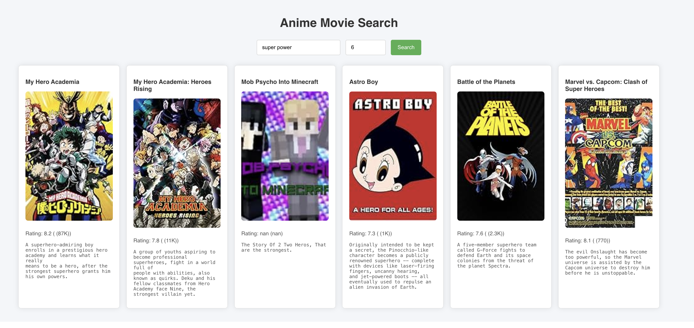

# Anime Recommendation System with Milvus Vector Database

This project is a system that recommends animes based on vector similarity using the **Milvus vector database**. The project leverages web scraping, text embeddings, and React for the user interface to deliver personalized anime recommendations.

---

## 🚀 Project Overview

The core idea of this project is to recommend animes by analyzing their descriptions. We scraped 1000 animes from IMDb using web scraping techniques and processed their data into vector embeddings with OpenAI's text embedding model. These embeddings are stored in the Milvus vector database. When a user searches for an anime, the system finds the most similar descriptions in the database and suggests the relevant animes.

---

## 🔧 Project Structure

1. **Web Scraping**:  
   - The script `anime_web_scraping.py` collects anime data from IMDb and stores it in `anime_data.csv`.  

2. **Backend**:  
   - **`backend.py`** processes the CSV data, converts descriptions into vector embeddings, and stores them in Milvus.  
   - A FastAPI backend is created to provide endpoints for querying the database.  

3. **Frontend**:  
   - A React-based user interface allows users to search for animes and view recommendations.  

---

## 🌟 Features

- **Web Scraping**: Collect anime data automatically.  
- **Vector Embeddings**: Convert text descriptions into vector format using OpenAI's embedding model.  
- **Vector Search**: Efficiently retrieve similar items from the database.  
- **User Interface**: A responsive React app to query and view recommendations.  

---

## 🛠️ Setup Instructions

### Prerequisites

- Python 3.9 or later  
- Node.js and npm  
- Docker installed  

### Step 1: Clone the Repository

```bash
git clone https://github.com/MehmetHilmiEmel/Movie_Recommendation.git
cd Movie_Recommendation
```
### Step 2: Virtual Environment Setup
#### For macOS/Linux:
```bash
python3.9 -m venv venv
source venv/bin/activate
```
#### For Windows:
```bash
python -m venv venv
venv\Scripts\activate
```
### Step 3: Install Dependencies
```bash
pip install -r requirements.txt
```

### Step 4: Start the Backend
Navigate to the backend directory:
```bash
cd backend
uvicorn backend:app --reload
```
### Step 5: Start the Frontend
Open a new terminal and navigate to the frontend directory:
```bash
cd frontend
npm install
npm start
```


### Step 6: Start the Milvus Database
Ensure Docker is installed, then run:
```bash
bash standalone_embed.sh start
```
---

## 📊 How It Works

1. **Data Collection**:  
   - Anime data is scraped from IMDb using the `anime_web_scraping.py` script.  
   - The collected data is saved into a CSV file named `anime_data.csv`.

2. **Data Embedding**:  
   - The descriptions of the animes are converted into vector embeddings using OpenAI's text embedding model.  
   - These embeddings, along with other anime details, are stored in the Milvus vector database.  

3. **Query Handling**:  
   - When a user submits a search query, it is converted into a vector embedding.  
   - The system searches the database for the closest matching vectors.  

4. **Recommendation**:  
   - Based on the closest matches, the system recommends animes that align with the user's query.  

5. **Backend API**:  
   - A FastAPI-based backend exposes an endpoint to query the database and retrieve recommendations.  

6. **Frontend Interaction**:  
   - A React-based frontend allows users to input their queries and view recommendations in an intuitive interface.  

---

## 🎯 Project Aim

This project demonstrates the use of vector databases to recommend animes based on content similarity. It highlights the integration of web scraping, vector embeddings, and database technologies in a seamless workflow.

---

## 🎥 Demo Video

Watch the full project creation process on YouTube:

[](https://www.youtube.com/watch?v=<video_id>)

---

## 🖼️ Screenshots



---

## 📚 Technologies Used

- **Python**: Backend logic and data processing.  
- **FastAPI**: API development.  
- **React**: Frontend framework.  
- **Milvus**: Vector database.  
- **Docker**: Containerization for Milvus.  
- **IMDb**: Data source.  
- **OpenAI**: Text embedding model.  

---

## ⚙️ Environment Variables

The backend requires an OpenAI API key to generate text embeddings. Create a `.env` file inside the `backend` directory with the following content:

```env
OPENAI_API_KEY=your_openai_api_key_here
```


